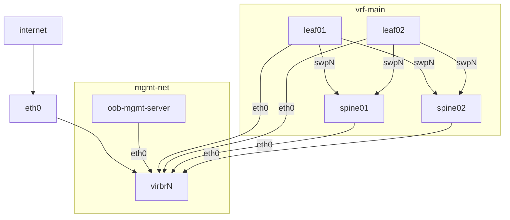

# libvirt-network-topology-tf

Some shell Terraform scipts to create a basic 2 leaf 2 spine topology from Debian Cloud machines.




### USAGE

Create topology

```
./tf apply
# wait a few seconds...
ssh debian@172.31.255.3

# view bgp routes
debian@leaf01:~$ sudo vtysh -c 'show bgp vrf vrf-main ipv4 unicast'
BGP table version is 5, local router ID is 10.0.0.2, vrf id 5
Default local pref 100, local AS 64514
Status codes:  s suppressed, d damped, h history, * valid, > best, = multipath,
               i internal, r RIB-failure, S Stale, R Removed
Nexthop codes: @NNN nexthop's vrf id, < announce-nh-self
Origin codes:  i - IGP, e - EGP, ? - incomplete
RPKI validation codes: V valid, I invalid, N Not found

   Network          Next Hop            Metric LocPrf Weight Path
*> 10.0.0.2/32      0.0.0.0(leaf01)          0         32768 ?
*= 10.0.0.3/32      swp2                                   0 64512 64515 ?
*>                  swp1                                   0 64512 64515 ?
*> 10.0.0.4/32      swp1                     0             0 64512 ?
*> 10.0.0.5/32      swp2                     0             0 64512 ?

Displayed  4 routes and 5 total paths

# verify connectivity between leaf01 & leaf02
debian@leaf01:~$ sudo ip vrf exec vrf-main ping -c1 10.0.0.3
PING 10.0.0.3 (10.0.0.3) 56(84) bytes of data.
64 bytes from 10.0.0.3: icmp_seq=1 ttl=63 time=0.472 ms

--- 10.0.0.3 ping statistics ---
1 packets transmitted, 1 received, 0% packet loss, time 0ms
rtt min/avg/max/mdev = 0.472/0.472/0.472/0.000 ms

```

Destroy topology

```
./tf destroy
```
